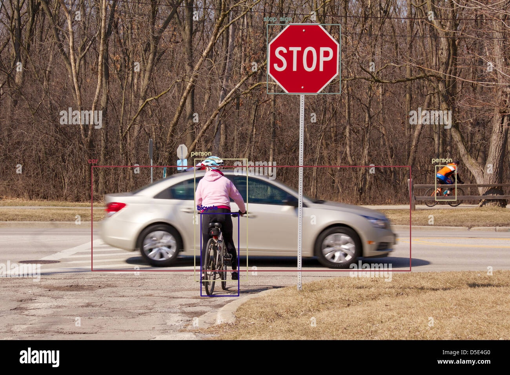

# Object-Detection
object detection with yolov3 for the detection of images and videos

command run code in the terminal with

> python yolo_opencv.py --image ./images/woman-on-bicycle.jpg --config yolov3.cfg --weights yolov3.weights --classes yolov3.txt

the results image detection

